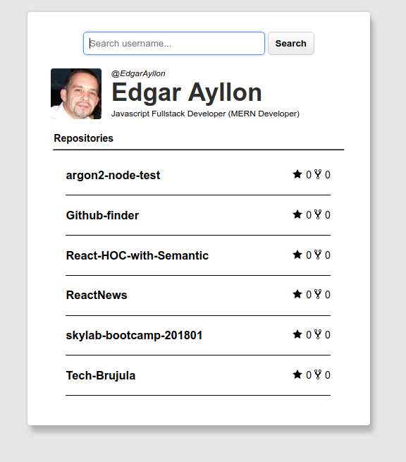

## Github user finder

GitHub user finder responsive SPA, retrieves info about user parse template and injects it to DOM.

### Use case

Download repo, launch index.html using your prefered browser, query user nickname using input text, press enter or search button.

### Methodologies
- Agile.
- Separation of concerns.
- Extendable throught classes.

### Technologies used

- `Javascript ES6` (ECMACScript2015):
    - Asynchronous calls using fetch API
    - Promises.
    - Event Listeners.
    - Dom elements manipulation.
    - Extending Classes.
    - Closures.
- `HTML5`:
    - HTML5 new tags ( Header, Section, Main, Article, Mark)
- `CSS3`:
    - Flex.
    - Media queries.
    - Rem units.
    - Browser hooks ( Not tested under IE, EDGE, linux develop environment ).
    - Pure CSS3 , classless ( no classes or id ).
- Resources:
    - SVG.

- Jasmine (for testing)

- Public Github API rest v3 without API Key.

### Screenshots

