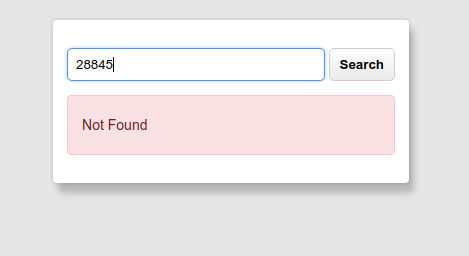
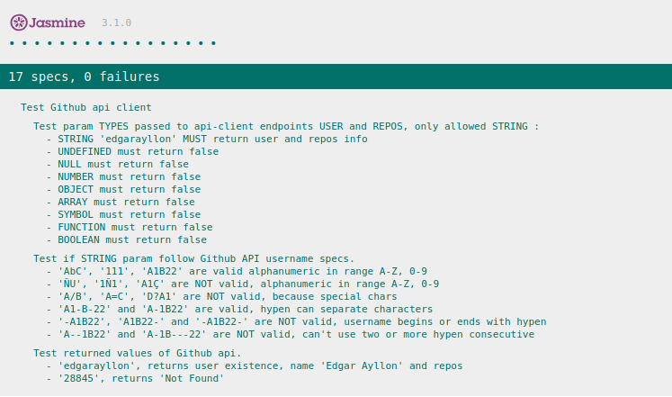

## Github user finder

GitHub user finder, simple UI to find user info.

### Online Demos

[App demo page](http://github-user-finder.surge.sh/)

[Test results page]( http://github-user-finder.surge.sh/test.html)

### Use case

Fill input with user nickname, press enter or search button, tha'ts all.

### Testing

Download repo, launch test.html to show test results.

### Technologies used

- `Javascript ES6` (ECMACScript2015):
    - Asynchronous calls using fetch API
    - Promises.
    - Event Listeners.
    - Dom element manipulation.
    - Closures.
- `HTML5`:
    - HTML5 new tags( Header, Section, Main)
- `CSS3`:
    - Flex.
    - Media queries.
    - Rem units.
    - Browser hooks.
    - No external libraries.
- Resources:
    - SVG.

- Jasmine (for testing)

- Public Github API rest v3 without API Key.

### Screenshots

