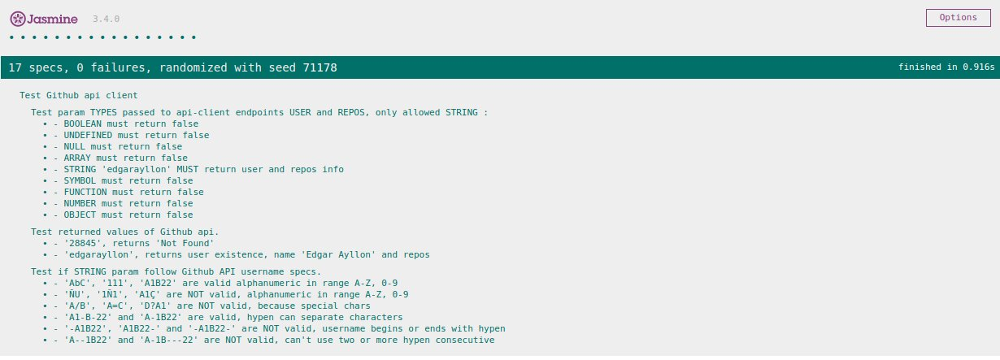

## Github user finder

GitHub user finder, simple UI to find user info.

### Online Demos

[App demo page](http://github-user-finder.surge.sh/)


### Use case

Fill input with user nickname, press enter or search button, tha'ts all.

### Testing

Download repo and use.
```
npm run test
```
or
```
yarn test
```

### Technologies used
- `Javascript ES6` (ECMACScript2015).
- `HTML5`.
- `SASS/SCSS/CSS3`.
- `WEBPACK 4` as package bundler.
- `KARMA and JASMINE` for TDD.

- Public Github API rest v3 without API Key.

### Screenshots


